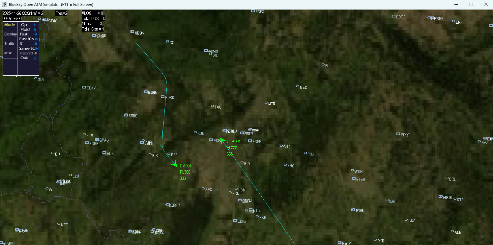
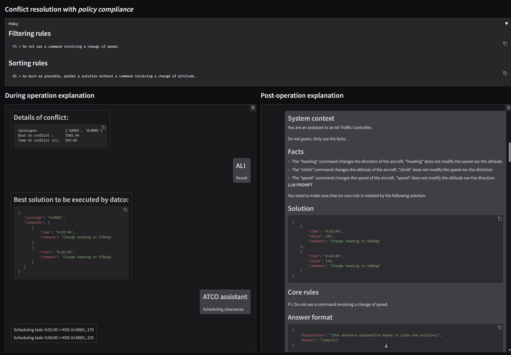

<!--
SPDX-FileCopyrightText: 2026 German Aerospace Center (DLR e.V.) <https://dlr.de>
SPDX-License-Identifier: CC-BY-4.0
-->

# ALI, the Air-traffic-control Language Interface

This project demonstrates the Air-traffic-control Language Interface presented in the paper:
[Leveraging Large Language Models as an Interface to Conflict Resolution for Human-AI Alignment in Air Traffic Control](https://doi.org/10.1109/DASC66011.2025.11257297).

The goal of this project is to experiment with LLM interface between Air Traffic Controllers and conflict resolution tools.

## Getting started

### Install uv

See the [uv documentation](https://docs.astral.sh/uv/getting-started/installation/).

On Linux/macOS run

```shell
curl -LsSf https://astral.sh/uv/install.sh | sh
```

and on Windows run

```powershell
powershell -ExecutionPolicy ByPass -c "irm https://astral.sh/uv/install.ps1 | iex"
```

### Install ALI, the Air-traffic-control Language Interface

```shell
uv sync
```

Astral's [uv](https://docs.astral.sh/uv/) automatically installs ALI inside a virtual environment.
Let's activate this environment:

- Linux/MacOS: `source .venv/bin/activate`
- Windows: `.venv\Scripts\activate`

### Ollama

This project requires access to a running [Ollama](https://ollama.com/) service.

#### Setup

To setup your own server (for up-to-date instructions, see the official documentation on [Github](https://github.com/ollama/ollama) or [website](https://ollama.com/download/linux)):

1. Install ollama

    ```sh
    curl -fsSL https://ollama.com/install.sh | sh
    ```

1. Pull a model, here `llama3.1:8b`:

    ```sh
    ollama pull llama3.1:8b
    ```

1. Start the server:

    ```sh
    ollama serve
    ```

You should have now a running Ollama server on `127.0.0.1:11434`, with `llama3.1:8b` available.

You can test your setup:

```sh
curl http://localhost:11434/api/chat -d '{
  "model": "llama3.1:8b",
  "messages": [
    { "role": "user", "content": "why is the sky blue?" }
  ]
}'
```

Will return a long list of generated words.

For the list of available models: [ollama/models](https://ollama.com/search)

#### Config

Enter the IP of your Ollama API in the `config.ini`.

Based on the setup example above, the `config.ini` must be:

```ini
[ollama]
ollama_ip = 127.0.0.1:11434
ollama_model = llama3.1:8b
```

This work was tested with `llama3.1:8b`, `llama3.1:70b` (quantization_level: Q4_K_M).

### Test installation

To test your installation:

```shell
pytest
```

### Run the demo

Once your installation is complete, simply run the ali demo with:

```sh
ali
```

The demo will load the default scenario `scenarios/01_minimal_ali_example` which contains:

- a *policy*, the list of rules to follow.
- a bluesky scenario, generating two aircraft on a collision route.

The demo will start two windows:

- the bluesky radar screen, displaying aircraft.
- a web interface, displaying the different steps of the conflict resolution.





The demo follows the steps:

1. conflict detected
1. generating a list of possible solutions to resolve the conflict
1. filtering the solutions according to the filtering rules
1. sorting the solutions according to the sorting rules
1. scheduling the commands from the best solution

### Troubleshooting

#### BlueSky

This project requires [bluesky](https://github.com/TUDelft-CNS-ATM/bluesky) ATC simulator package.

If the pip installation fails to install bluesky, it can be manually installed as follows:

```sh
# activate your virtual environment
git clone https://github.com/TUDelft-CNS-ATM/bluesky.git
cd bluesky
uv pip install -e .
```

#### Ollama API tests failure

Depending on your Ollama setup, it is probable to fail the tests:

- `tests/test_0_ollama-api.py::test_chat_seed`
- `tests/test_0_ollama-api.py::test_chat_greedy`

These test are only useful to pass if you want to execute reproducible results.

Failure does not impact the usage of this module.

## Acknowledgment

This work was realized thanks to the contributions of:

- [DLR Institute of Aerospace Medicine](https://www.dlr.de/en/me/about-us/departments/aerospace-psychology)

   for the use case based on the [LOKI](https://www.dlr.de/en/dw/research-transfer/projects/loki) project and workshops with ATCOs, and their expertise in Human Factors.

- [DLR Institute of Flight Guidance](https://www.dlr.de/en/fl/about-us/institute)

    for the concept of Single Controller Operation and their expertise in Air Traffic Control.

- [DLR Institute for AI Safety and Security](https://www.dlr.de/en/ki/)

   for developing the concept and algorithm for the ATC Language Interface, developing this prototype, and performing the experiments.

## Citation

For accurate citation of this work, refer to the corresponding metadata in the `CITATION.cff` file associated with this work.

To cite our paper:

```bib
@INPROCEEDINGS{11257297,
  author={Berro, Charles and Deligiannaki, Fotini and Stefani, Thomas and Christensen, Johann Maximilian and Gerdes, Ingrid and Köster, Frank and Hallerbach, Sven and Raulf, Arne},
  booktitle={2025 AIAA DATC/IEEE 44th Digital Avionics Systems Conference (DASC)},
  title={Leveraging Large Language Models as an Interface to Conflict Resolution for Human-AI Alignment in Air Traffic Control},
  year={2025},
  pages={1-10},
  keywords={Large language models;Natural languages;Filtering algorithms;Safety;Air traffic control;Research and development;Optimization;Synthetic data;Strain;Sorting;Air Traffic Control;Single Controller Operation;Large Language Models},
  doi={10.1109/DASC66011.2025.11257297}
}
```
